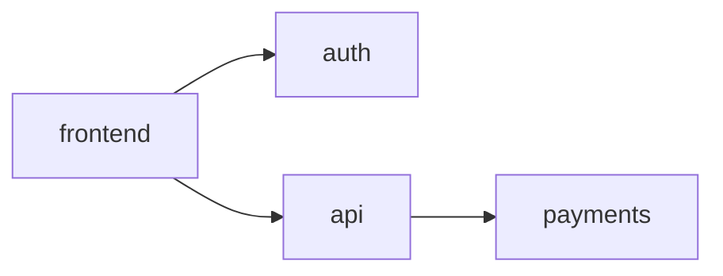

# Open Recipes — Specification v0.1

## What is Open Recipes?

Open Recipes is an open standard for describing how products are assembled — the tools, services, and ingredients chosen, how they connect, and the reasoning behind each decision.

A recipe is not code. It is not infrastructure. It is a structured, human-authored document that captures the *architecture of a product* at the ingredient level — regardless of whether that product is a SaaS application, a hardware device, a self-hosted server setup, or anything else made of assembled parts.

Recipes are designed to be:
- **Read by humans** — as a reference, a starting point, or a learning resource
- **Consumed by AI** — as context that removes the need to re-explain stack decisions
- **Executed by agents** — to walk through setup step by step, fetch live pricing, or compare alternatives
- **Versioned and forked** — using Git, so the history of decisions and substitutions is preserved

---

## Format

Each recipe is a `recipe.yaml` file, optionally accompanied by a `README.md` for richer narrative including a Mermaid visualization.

### `recipe.yaml`

```yaml
name: "Bootstrapped SaaS on AWS"
description: "Minimal viable SaaS stack for solo founders — auth, payments, API, frontend"
version: "1.0"
author: "github-username"
license: "CC-BY-4.0"
tags: [saas, aws, bootstrapped, solo-founder]

ingredients:
  - id: auth
    name: Supabase Auth
    url: https://supabase.com
    docs: https://supabase.com/docs
    role: "User authentication and session management"
    why: "Avoids building auth from scratch, generous free tier"
    alternatives: [Clerk, Auth0]

  - id: payments
    name: Stripe
    url: https://stripe.com
    docs: https://docs.stripe.com
    role: "Payment processing and subscriptions"
    why: "Industry standard, best documentation, straightforward webhooks"
    alternatives: [Paddle, Lemon Squeezy]

  - id: frontend
    name: Next.js on Vercel
    url: https://vercel.com
    docs: https://vercel.com/docs
    role: "Frontend framework and hosting"
    why: "Zero-config deployment, edge network, works well with Supabase"
    alternatives: [Netlify, Cloudflare Pages]

  - id: api
    name: AWS Lambda
    url: https://aws.amazon.com/lambda
    docs: https://docs.aws.amazon.com/lambda
    role: "Backend API and business logic"
    why: "Pay-per-use, no idle cost for early stage"
    alternatives: [Railway, Render, Fly.io]

relations:
  - from: frontend
    to: auth
    how: "Supabase JS client manages sessions client-side"
  - from: frontend
    to: api
    how: "REST calls with JWT from Supabase Auth"
  - from: api
    to: payments
    how: "Stripe SDK for checkout, webhooks update subscription state"

setup:
  - "Go to supabase.com, create a new project, copy the ANON_KEY and project URL"
  - "Go to stripe.com, create an account, enable test mode, copy API keys"
  - "Deploy frontend to Vercel, connect your Git repo, set environment variables"
  - "Create Lambda functions via AWS console or SAM, configure API Gateway"
  - "Register Stripe webhook endpoint pointing to your Lambda URL"
```

---

## Fields Reference

### Recipe-level

| Field | Required | Description |
|---|---|---|
| `name` | yes | Short human-readable name |
| `description` | yes | One sentence explaining what this recipe builds |
| `version` | yes | Recipe version (semver) |
| `author` | yes | GitHub username of original author |
| `license` | yes | Recommended: CC-BY-4.0 |
| `tags` | no | Keywords for discovery |

### Ingredient

| Field | Required | Description |
|---|---|---|
| `id` | yes | Unique identifier used in relations |
| `name` | yes | Name of the tool or service |
| `url` | yes | Homepage — entry point for humans and pricing agents |
| `docs` | no | API/technical documentation root — used by AI for code generation |
| `role` | yes | What this ingredient does in the product |
| `why` | yes | Reason it was chosen over alternatives |
| `alternatives` | no | Other options that could fill this role |

### Relation

| Field | Required | Description |
|---|---|---|
| `from` | yes | Ingredient id |
| `to` | yes | Ingredient id |
| `how` | yes | Brief description of how they integrate |

### Setup

An ordered list of plain-language steps to go from zero to running. Steps can reference ingredient URLs and should be actionable — "go here, do this, copy that."

---

## Diagram

Each recipe can include a `diagram.md` with a Mermaid graph generated from the `relations` block. GitHub renders Mermaid natively.

```markdown

```

---

## Pricing

Pricing is intentionally **not part of the recipe file**. Prices change, plans evolve, and a recipe with embedded costs goes stale quickly. Instead, pricing is a live layer — tooling can fetch current pricing from service APIs or websites at the moment it is needed, based on the ingredient URLs declared in the recipe.

---

## Community and Evolution

Open Recipes uses GitHub as its collaboration layer — nothing extra is needed.

- **Comments and issues** are where experience lives. If Supabase RLS caused you problems, open an issue on the recipe. If Lambda cold starts hurt your use case, say so.
- **Forks and branches** are how substitutions are proposed. Fork a recipe, swap one ingredient, write your reasoning in the PR description. The git history becomes the collective knowledge base.
- **Pull requests** are how recipes evolve. A well-written PR that replaces one ingredient and explains why is more valuable than any structured field inside the file.

Recipes are not meant to be perfect or universal. They are starting points with a clear point of view, open to challenge.

---

## Repository Structure

In a monorepo on GitHub:

```
open-recipes/
  recipes/
    bootstrapped-saas-aws/
      recipe.yaml
      diagram.md
      README.md
    home-media-server/
      recipe.yaml
      diagram.md
    iot-sensor-stack/
      recipe.yaml
  SPEC.md        ← this document
  CONTRIBUTING.md
```

---

## Consuming a Recipe

### As a human
Read `recipe.yaml` and `README.md` to understand the stack and the reasoning. Fork it as your starting point.

### With an AI assistant
Paste the recipe into your AI context. The assistant immediately understands your stack decisions and can generate code, configuration, or advice without you re-explaining your choices.

### With an agent
An agent can walk through the `setup` steps, resolve URLs, fetch live pricing for each ingredient, and produce a personalised cost estimate or a step-by-step interactive setup guide.

---

## License

The spec itself is released under CC0 (public domain). Individual recipes carry their own license — CC-BY-4.0 is recommended.

---

## Status

This is v0.1 — a starting point, not a finished standard. The schema will evolve through community discussion. Open an issue to propose changes.
