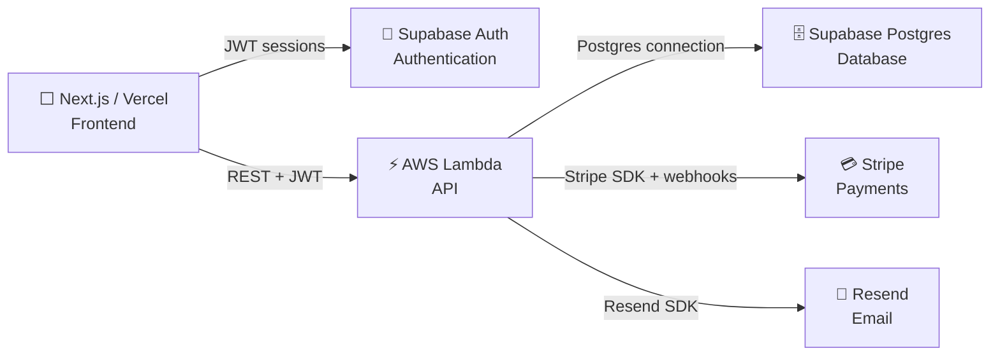

# Bootstrapped SaaS on AWS

```mermaid
graph LR
  frontend["⬜ Next.js / Vercel\nFrontend"]
  auth["🔐 Supabase Auth\nAuthentication"]
  database["🗄️ Supabase Postgres\nDatabase"]
  api["⚡ AWS Lambda\nAPI"]
  payments["💳 Stripe\nPayments"]
  email["📧 Resend\nEmail"]

  frontend -->|"JWT sessions"| auth
  frontend -->|"REST + JWT"| api
  api -->|"Postgres connection"| database
  api -->|"Stripe SDK + webhooks"| payments
  api -->|"Resend SDK"| email
```
